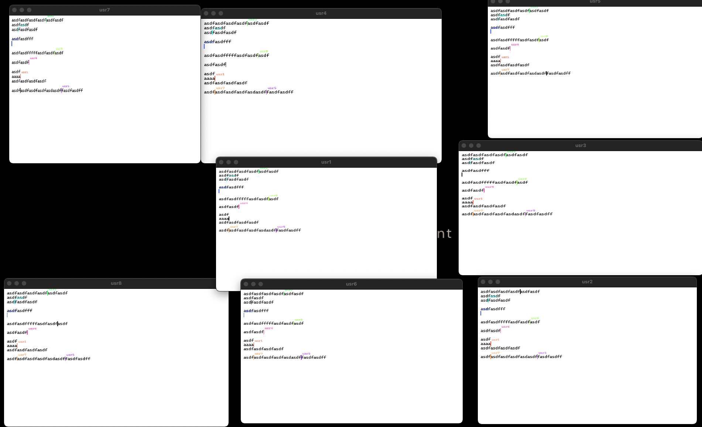

# Real-Time Chat System


## Table of Contents

- [Introduction](#introduction)
- [Features](#features)
- [Requirements](#requirements)
- [Installation](#installation)
- [Usage](#usage)
- [File Structure](#file-structure)
- [Contributing](#contributing)
- [License](#license)
- [Contact](#contact)

## Introduction


Welcome to the **Real-Time Chat System** repository! This project implements a multi-client chat system in C++ using socket programming. The system enables real-time communication between multiple users through a central server, featuring concurrent connections and message broadcasting capabilities.

## Features

- **Multi-Client Support:** Allows multiple clients to connect and communicate simultaneously.
- **Real-Time Communication:** Instant message broadcasting to all connected clients.
- **Automatic Reconnection:** Handles dropped connections with automatic reconnection attempts.
- **Error Handling:** Robust mechanisms to handle various connection and runtime errors.
- **Connection Status Monitoring:** Provides real-time status updates of client connections.

## Requirements

- **Operating System:** Linux
- **Compiler:** `g++` with C++11 support
- **Other Tools:** `make`

## Installation

Follow these steps to set up the project locally:

1. **Clone the Repository**
    ```bash
    git clone https://github.com/Jerrychin125/NP-Final.git
    ```

2. **Navigate to the Project Directory**
    ```bash
    cd NP-Final
    ```

3. **Build the Project Using Make**
    ```bash
    make
    ```

    - To build only the server:
        ```bash
        make server
        ```
    - To build only the client:
        ```bash
        make client
        ```
    - To clean build files:
        ```bash
        make clean
        ```

## Usage

### Starting the Server

Run the server executable with the desired port number:

```bash
./server [port]